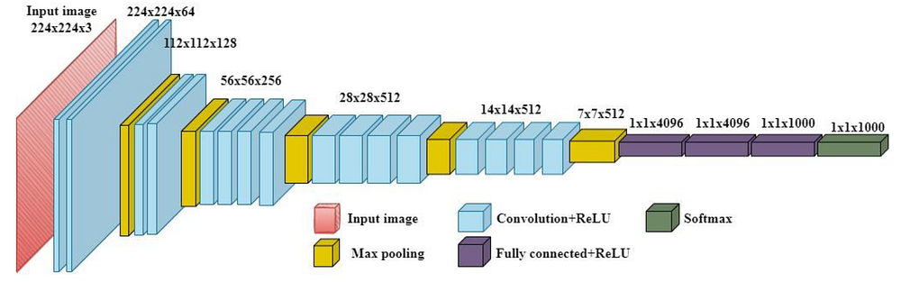
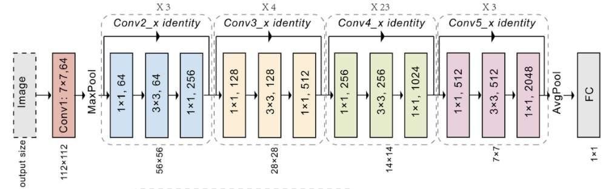
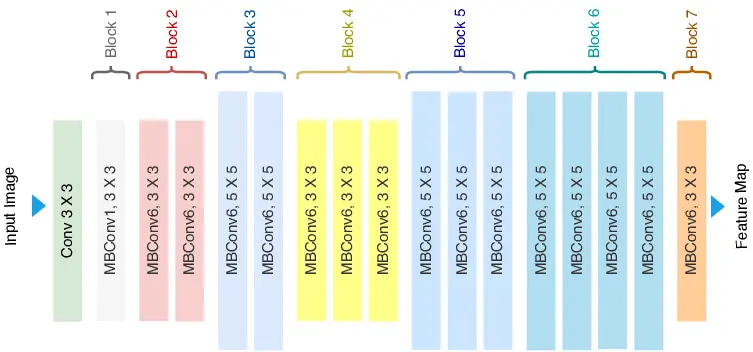
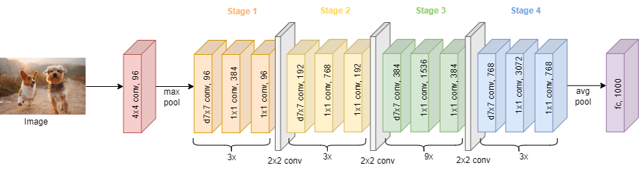
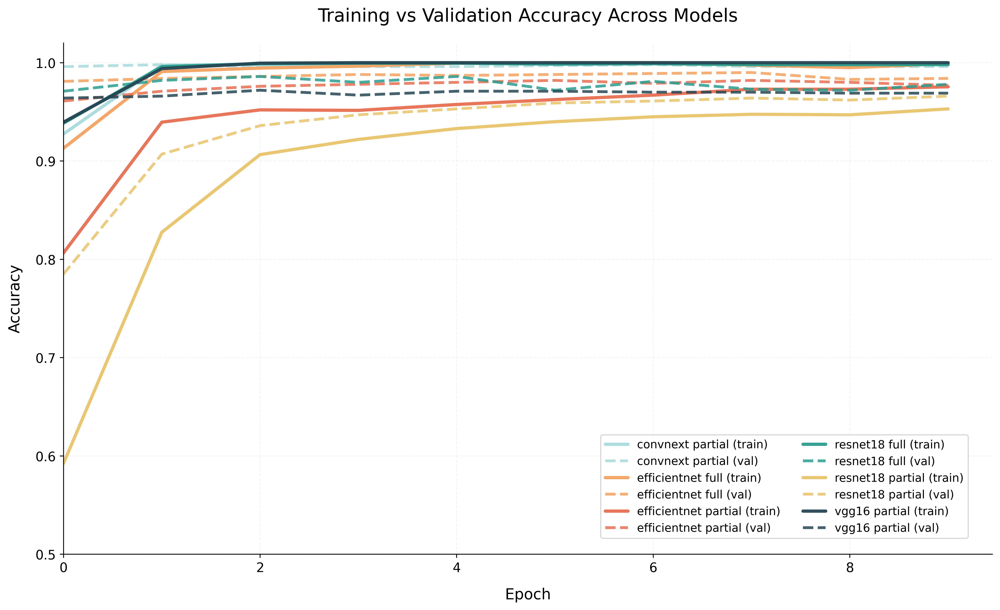
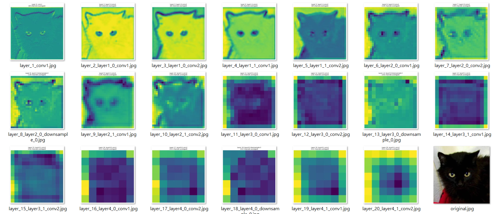

# CNN-Transfer-Learning-Fine-Tuning
## Introduction
In this study, we investigate the performance of different convolutional neural network (CNN) 
architectures on a binary image classification task (cats vs dogs). Specifically, we compare multiple 
pretrained models under different transfer learning strategies, including feature extraction (freeze), 
partial fine-tuning, and full fine-tuning. The goal is to understand how model architecture and 
training strategy affect performance, convergence behavior, and generalization.

## Models
* ###  VGG

For a given set of features, stacking small convolutional kernels is superior to using large 
convolutional kernels because stacking multiple non-linear layers increases the network 
depth, allowing the model to learn more complex features while reducing computational 
complexity by having fewer parameters. In terms of architecture design, VGG uses three 
3x3 convolutional kernels to replace one 7x7 convolutional kernel, and two 3x3 
convolutional kernels to replace one 5x5 convolutional kernel. This approach increases the 
network depth while maintaining a similar receptive field of view, thus improving model 
performance to some extent.

* ###  ResNet

When plain convolutional stacks encounter the infamous degradation phenomenon—where 
accuracy saturates and then plummets as depth grows despite greater theoretical capacity—
ResNet reframes the entire optimization landscape through residual learning. Rather than 
compelling each layer to approximate an arbitrary underlying mapping H(x), the architecture 
explicitly lets stacked layers learn only the residual F(x) = H(x) − x, with the shortcut 
connection providing an identity path that is trivially optimal when no further refinement is 
needed. This subtle algebraic reformulation is profoundly insightful: it does not merely 
mitigate vanishing gradients by enabling direct gradient flow across hundreds of layers; it 
expands the hypothesis space to include identity functions as a natural baseline, 
transforming an ill-conditioned optimization problem into one that is inherently stable and 
scalable. Architecturally, the residual block deploys two or three 3×3 convolutions (often 
with a 1×1 bottleneck for efficiency in deeper variants), allowing ResNet-152 to achieve 
lower training error than its 34-layer counterpart while delivering unprecedented ImageNet 
gains—thus establishing depth not as a liability, but as a controllable asset that redefined 
what “deep” truly means in neural network design.

* ###  EfficentNet

Amid the explosive growth of model size and the harsh realities of deployment on resource
constrained devices, EfficientNet discards the ad-hoc scaling practices of prior eras and 
introduces a rigorously derived compound scaling rule that treats depth, width, and 
resolution as interdependent variables governed by a single coefficient φ. Derived from 
neural architecture search on a mobile-optimized baseline, the method reveals a hidden 
optimality principle: balanced multiplicative growth (depth scaled by α^φ, width by β^φ, 
resolution by γ^φ, subject to αβ²γ² ≈ 2) yields performance curves that previous one
dimensional scaling strategies could never approach. The insight is almost philosophical—
model capacity is not an isolated dimension to be arbitrarily inflated but a three-dimensional 
manifold whose most efficient traversal requires harmonious expansion; any imbalance 
wastes parameters or FLOPs. Concretely, EfficientNet-B0 serves as the NAS-searched seed, 
and the B1–B7 family applies progressive φ values to deliver state-of-the-art accuracy with 
8–10× fewer FLOPs than contemporaries.

* ###  ConvNeXt

At the height of transformer euphoria, where self-attention was hailed as the sole path to 
global modeling and CNNs were prematurely declared obsolete, ConvNeXt executes a 
masterful architectural counter-reformation: it modernizes the humble convolutional 
paradigm by transplanting the most effective transformer-inspired ingredients—larger 7×7 
depthwise kernels for expanded receptive fields, inverted bottlenecks that concentrate 
computation where it matters, stage-wise scaling that mimics hierarchical ViT pyramids, and 
layer normalization paired with modern training recipes—while deliberately retaining the 
inductive biases of locality and translation equivariance that attention mechanisms discard. 
The deeper wisdom here is paradigm-shifting: many of the gains credited to transformers 
arise not from attention itself but from macro design choices, scaling strategies, and training 
hygiene that any well-engineered CNN can adopt. By closing this gap, ConvNeXt-Tiny 
surpasses DeiT equivalents on ImageNet while offering 2–4× higher throughput and far 
simpler implementation. In doing so, it does not merely compete; it exposes a profound 
ontological truth about modern vision backbones—that the future belongs not to the 
architecture that shouts “attention” loudest, but to the one that most intelligently synthesizes 
the best of both worlds. ConvNeXt thus restores convolutional networks to the forefront, 
proving that purity of inductive bias, when refined with contemporary insight, remains an 
unbeatable foundation for scalable, generalizable vision intelligence.

## Fine-Tune Strategy
In this study, three transfer learning strategies are adopted to investigate the impact of different fine
tuning approaches on model performance. These strategies determine which parts of the pretrained 
convolutional neural networks (CNNs) are updated during training.
* Freeze  
In the freeze strategy, all convolutional backbone layers are fixed, and only the final 
classification layer is trained. This approach treats the pretrained network as a feature 
extractor and prevents modification of learned representations. This strategy is 
computationally efficient and reduces the risk of overfitting, especially when the dataset is 
small. However, it may limit the model’s ability to adapt to the target task.
* Partial Fine-Tuning  
In partial fine-tuning, the last portion of the convolutional layers (e.g., final block or stage) 
along with the classifier are trained, while earlier layers remain frozen. This approach allows 
the model to adapt higher-level features to the target domain while preserving low-level 
representations such as edges and textures. It provides a balance between stability and 
flexibility, often resulting in improved performance compared to full freezing.
*  Full Fine-Tuning   
In full fine-tuning, all layers of the pretrained model are updated during training. This 
enables the model to fully adapt to the new task and potentially achieve the best 
performance. However, this strategy requires more computational resources and is more 
prone to overfitting, particularly when the dataset is limited.

## Experiment Setup
The experiments are conducted on a binary image classification dataset:   
**Cats vs Dogs**
The dataset is divided into three subsets: 
* Training set 
*  Validation set 
* Test set   

The training set is used for model learning, the validation set is used for model selection and 
hyperparameter tuning, and the test set is used for final performance evaluation

**Training setting**
To ensure a fair comparison across different models and strategies, all experiments share identical 
training configurations:
*  Optimizer: AdamW 
* Batch size: 32 
* Number of epochs: 10 
* Data augmentation: consistent across all models 

By controlling these variables, the influence of model architecture and fine-tuning strategy can be 
isolated and fairly evaluated.

**Evaluation metrics**   
The following metrics are used to evaluate model performance:
* Accuracy  
Measures the proportion of correctly classified samples. 
* Validation Loss   
Used to monitor convergence behavior and detect overfitting during training. 
* Training Time   
Records the computational cost associated with each model and strategy. 

The best model is selected based on validation performance, and final results are reported using test 
accuracy

## Results 
### Training & Evalidation Curve

### Experiment Results

| Model          | Strategy       | Valid Acc | Test Acc | Training Time | Rank |
|----------------|----------------|-----------|----------|---------------|------|
| VGG16          | Partial        | 97.2%     | 97.4%    | 1197.2s       | 5    |
| ResNet-18      | Partial        | 96.6%     | 95.7%    | 227.93s       | 6    |
| ResNet-18      | Full           | 98.6%     | 98.2%    | 563.48s       | 3    |
| EfficientNet-b0| Partial        | 98.2%     | 96.9%    | 232.48s       | 4    |
| EfficientNet-b0| Full           | 99.0%     | 98.7%    | 650.19s       | 2    |
| ConvNeXt       | Partial        | 99.8%     | 99.6%    | 747.46s       | 1    |

### Feature Maps Visualize
**ResNet-18**

## Discussion 
This section analyzes the experimental results from multiple perspectives, including the impact of 
fine-tuning strategies, architectural differences, overfitting behavior, and efficiency-performance 
trade-offs

### Freeze vs Fine-Tune 
The experimental results clearly demonstrate that fine-tuning strategies outperform the freeze strategy across all models. Partial and full fine-tuning consistently achieve higher validation and test accuracy 
compared to feature extraction. This indicates that, even for a relatively simple binary classification task such as Cats vs Dogs, adapting pretrained representations to the target domain is crucial for achieving optimal performance.

Among the fine-tuning strategies, full fine-tuning generally yields the highest accuracy. For 
example, EfficientNet-B0 improves from 98.2% (partial) to 99.0% (full) in validation 
accuracy, while also achieving strong test performance (98.7%). Similarly, ResNet-18 shows 
a significant improvement when switching from partial (96.6%) to full fine-tuning (98.6%).
However, the performance gain from full fine-tuning comes at the cost of increased training 
time and higher risk of overfitting. In contrast, partial fine-tuning provides a strong balance 
between performance and computational efficiency.

###  Model Architecture Comparison 
Different CNN architectures exhibit distinct performance characteristics under the same training conditions. 
Among all models, ConvNeXt achieves the best overall performance, reaching 99.8% validation accuracy and 99.6% test accuracy under the partial fine-tuning strategy. This suggests that modernized convolutional architectures with improved design principles can 
significantly outperform traditional CNNs.

EfficientNet also performs strongly, especially under full fine-tuning, demonstrating the 
effectiveness of compound scaling in balancing model capacity and efficiency. ResNet-18, 
while stable and efficient, shows comparatively lower performance, particularly under 
partial fine-tuning. This indicates that shallower architectures may have limited 
representational capacity for capturing more complex patterns.
VGG16 achieves relatively high accuracy (97.4% test accuracy), but requires significantly 
longer training time (1197.2s), highlighting its inefficiency compared to more modern 
architectures.

###  Overfitting Analysis
Overfitting can be observed by comparing training and validation performance trends. In 
general, models under full fine-tuning show a higher tendency to overfit, especially when 
the dataset size is limited. This is because updating all parameters increases model 
flexibility, which may lead to memorization rather than generalization.

Partial fine-tuning mitigates this issue by preserving low-level features while only adapting 
high-level representations. As a result, it often achieves competitive accuracy with better 
generalization stability.
From the training curves, models such as EfficientNet and ConvNeXt exhibit smoother 
convergence and smaller gaps between training and validation accuracy, indicating better 
generalization behavior.

###  Efficiency vs Accuracy Trade-off
The trade-off between computational cost and model performance is an important 
consideration. ConvNeXt achieves the highest accuracy but requires relatively longer 
training time compared to lightweight models. EfficientNet provides a strong balance, 
achieving near state-of-the-art accuracy with moderate computational cost.

ResNet-18 stands out as the most efficient model in terms of training time (as low as 
227.93s), but sacrifices some accuracy. VGG16 is the least efficient, with the longest 
training time and no significant advantage in performance, making it less practical for real
world applications. 
Overall, EfficientNet and ConvNeXt offer the best trade-off between accuracy and 
efficiency, while partial fine-tuning provides an effective compromise between performance 
and resource usage

## Conclusion
The results show that fine-tuning plays a critical role in improving model performance. Both partial 
and full fine-tuning significantly outperform the freeze strategy, demonstrating the importance of 
adapting pretrained features to the target domain.

Among the evaluated models, ConvNeXt achieves the best overall performance, while EfficientNet 
provides an excellent balance between accuracy and computational efficiency. Traditional 
architectures such as VGG16 and ResNet-18, although still effective, are less competitive compared 
to more modern designs.

Furthermore, partial fine-tuning emerges as a practical and robust strategy, offering strong 
performance with reduced risk of overfitting and lower computational cost compared to full fine
tuning.