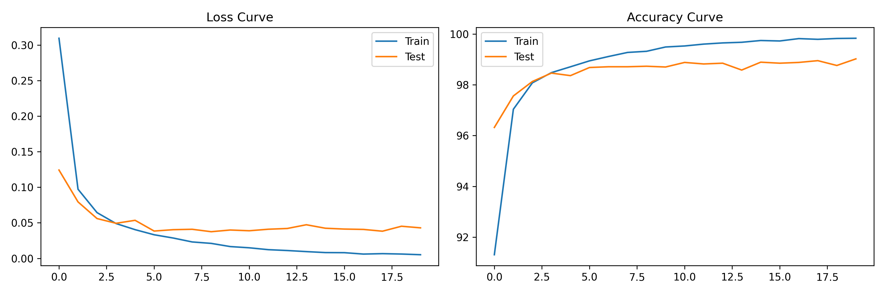
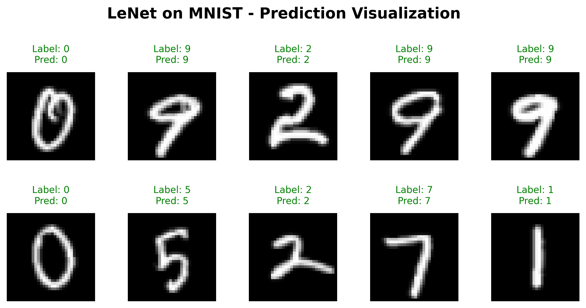
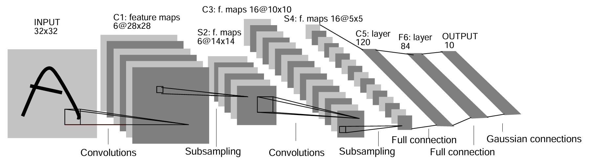

# LeNet Experiment on MNIST
## Introduction
In this project, I conducted a small experimental study to reimplement LeNet-5 (1998) for the MNIST image classification task. The primary objective was to reconstruct a convolutional neural network (CNN) architecture similar to the original design using PyTorch and to evaluate its performance on handwritten digit recognition.

LeNet-5, originally proposed by Yann LeCun and colleagues in 1998, was one of the earliest successful applications of convolutional neural networks to image classification. By reproducing a comparable CNN architecture, this project demonstrates how early CNN models effectively learned hierarchical visual features and achieved strong performance on handwritten digit classification.

The experimental results show that the implemented model successfully classifies handwritten digits from the MNIST dataset, thereby validating the effectiveness of classical CNN architectures in supervised image recognition tasks.

## Environment
- Python 3.10
- PyTorch 2.5.1
- CUDA 

## Training Setup
- Loss Function &nbsp; :  &nbsp; **Cross Entropy**   
    A matric used to measure the difference between two probabillity distributions (the true distribution and the predicted distribution). It calculates the average coding length required to represent the true distribution using the predicted distribution. The lower cross-entropy, the more accurate the prediction.
- Optimizer  &nbsp; :  &nbsp; **Adam Optimizer**   
    Adam retains Momentume's gradient rate adjust based on the direction of past gradients and Adam's learning rate adjustment based on the squared value of past gradients. In addition, Adam performs parameter "Deviation Correction", ensuring that the learning rate has a defined range for each iteration, resulting in more stable parameter updates.

- Learning rate &nbsp; :  &nbsp; **0.0005**
- Batch size &nbsp; :  &nbsp; **32**
- Epochs &nbsp; :  &nbsp; **20**

## Expirement Result
### Training Curve

### Confusion Matrix

### Demo

### Model Parameter
&nbsp;&nbsp;&nbsp;&nbsp; Run Test with Python Script : *ClassifyTask_test.py*   
&nbsp;&nbsp;&nbsp;&nbsp; The model achieved a test accuracy of 99.02%

## LeNet 5

After 10 years of research and improvement, Yann LeCun, Yoshua Bengio, and others published "Gradient Based Learning Applied to Document Recognition" in 1998, which can be considered the earliest widely used CNN. The paper has been cited over 70,000 times to date. LeNet's design aimed to build better pattern recognition systems by relying on more automated learning and reducing manually designed heuristic rules. A major problem with traditional methods is that recognition accuracy largely depends on whether the designer can come up with a suitable feature set. The paper mentions the technological evolution in recent years, with key shifts including the widespread availability of high-speed hardware, large datasets, and learning algorithms capable of handling high-dimensional inputs. CNNs address this by using weight sharing and local receptive fields to automatically obtain translation invariance. Furthermore, the convolutional kernels themselves maintain the image topology, allowing them to reference local correlations between neighboring pixels, effectively capturing local features and gradually combining them into higher-order features.

The first layer (C1) is a convolutional layer with 6 learnable convolutional kernels, each 5 × 5 with a stride of 1 and no padding. It outputs 6 corresponding feature maps, each 28 × 28 in size, with 156 trainable parameters.

The second layer (S2) performs subsampling, applying average pooling to the feature maps. The average convolutional kernel size used is 2 × 2 with a stride of 2 to ensure non-overlapping receptive fields. The feature maps are then reduced to a 14 × 14 feature map using either a Sigmoid or Tanh activation function. Layer S2 has 12 trainable parameters.

The third layer (C3) is a convolutional layer with 16 kernels, each 5 × 5 in size, with a stride of 1 and no padding. LeNet calculates the first six feature maps as three consecutive feature maps from S2, the next six as four consecutive feature maps from S2, three as four non-consecutive feature maps, and the last one calculates all six. The pixels in each output feature map are the sum of the convolutions of all input feature maps. C3 has 1,516 trainable parameters.

The fourth layer (S4) is a subsampling layer with the same parameter configuration as the second layer (S2). After activation, it generates 16 feature maps, each 5 × 5 in size, with 32 trainable parameters.

The fifth layer (C5) is a convolutional layer with 120 kernels corresponding to the output feature maps. Each kernel is 5 × 5 in size and is fully connected.

The sixth layer (F6) is a fully connected MLP layer containing 84 units to connect to the MLP output layer. Since this is a demonstration of the MNIST handwritten digit recognition system, the output consists of 10 values, corresponding to the probability of each category.

While using mean squared error as the loss function is simple, it has drawbacks in classification tasks, lacking the competitive effect between classes and potentially causing network parameter collapse. A method similar to softmax + cross-entropy is proposed, using log-posterior probability to increase the score of the correct class while suppressing the score of the incorrect class, thus enhancing the discriminative power of classification. The paper concludes with several important training techniques in the appendix: the activation function uses a tanh variant approximating sigmoid; weight initialization employs a suitable initialization strategy for shared parameters; and the optimizer uses a randomized version of the Levenberg-Marquardt algorithm, which is faster than simple SGD. These details ensured that LeNet-5 could be effectively trained using CPUs without GPUs, given the computational resources available at the time.