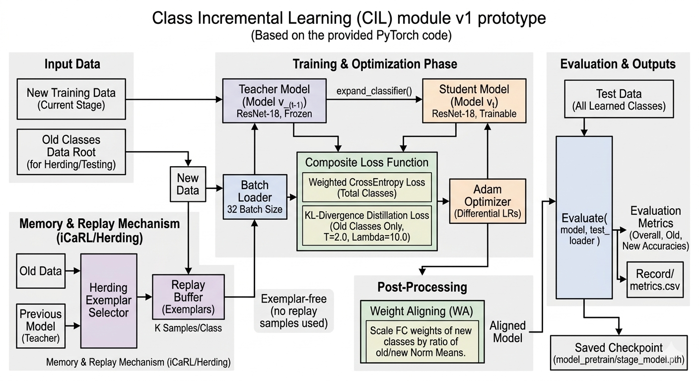
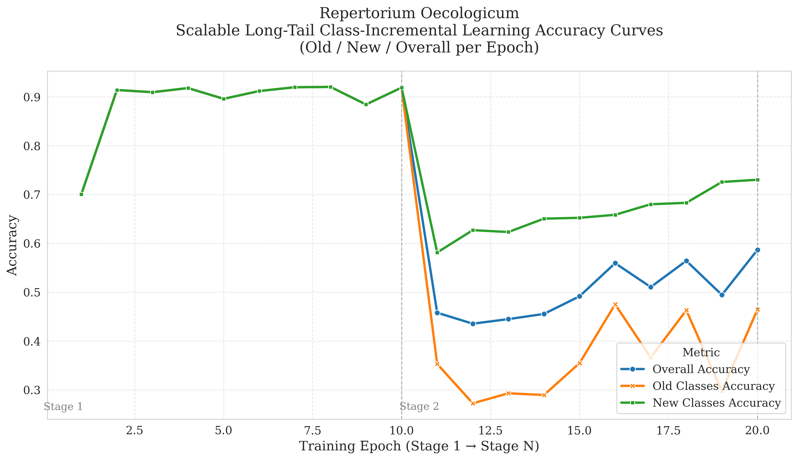

# Replay KLWA : A Feasible Few Replay CIL

## CIL Experimental Diagram
In the continual learning experimental design, the data pipeline and evaluation mechanism must strictly correspond to the characteristics of gradual class expansion and limited historical data in real-world application scenarios. To this end, this experiment simulates an open-world scenario using a multi-stage setting, sequentially dividing the complete class set into five subsets ( S1 to S5 ) and gradually introducing new classes at different stages. The training data at each stage contain only the current new classes, while the test data accumulate all classes that have appeared, in order to evaluate the model's ability to balance learning new knowledge and retaining old knowledge. This design enables the evaluation metrics ( overall accuracy, old-class accuracy, and forgetting degree ) to accurately reflect the stability and generalization ability of the model during its long-term evolution, and also conforms to the non-static characteristic of species being continuously discovered in ecological research. Based on the above principles, the experiment is further divided into two representative settings: one is the few-replay mode with a limited memory replay mechanism, and the other is the exemplar-free mode that does not use any historical samples, respectively corresponding to two extreme but common conditions in practice where data can be partially retained and where old data cannot be retained. Each stage is defined as one expansion stage of the class set, corresponding to a batch of newly introduced species classes and their training process.

### Table 1. Few Replay & Exemplar Free Class Incremental Learning

| Few Replay |  |  | Exemplar Free |  |  |
|---|---|---|---|---|---|
| Stage | Train Set | Test Set | Stage | Train Set | Test Set |
| 1 | S1 | S1 | 1 | S1 | S1 |
| 2 | S2∪M(20),(S1) | S1∪S2 | 2 | S2 | S1∪S2 |
| 3 | S3∪M(20),(S1∪S2) | S1∪S2∪S3 | 3 | S3 | S1∪S2∪S3 |
| 4 | S4∪M(20),(S1∪S2∪S3) | S1∪S2∪S3∪S4 | 4 | S4 | S1∪S2∪S3∪S4 |
| 5 | S5∪M(20),(S1∪S2∪S3∪S4) | S1∪S2∪S3∪S4∪S5 | 5 | S5 | S1∪S2∪S3∪S4∪S5 |

  
  
Through the comparison of the above two settings, this study can systematically analyze the actual contribution of memory mechanisms in mitigating catastrophic forgetting, as well as the adaptability of different methods under data-constrained conditions. In the few-replay setting, the selection strategy for limited samples ( such as herding, random sampling, or prototype-based selection ) will directly affect the extent to which the model maintains the decision boundaries of old classes; whereas in the exemplar-free setting, the model relies entirely on knowledge distillation and representation constraints to preserve historical information, and its performance can better reflect the method's own modeling capability for representation stability. Furthermore, through cross- stage metric analysis ( such as backward transfer and forgetting measure ) , the knowledge transfer and degradation behavior of the model across different stages can be quantified, and a basis can be provided for subsequent method design ( such as loss function adjustment, memory strategy optimization, or architectural improvement ) . Overall, this experimental design not only serves as a tool for method validation, but also constitutes the core evaluation framework in the system development process, enabling model optimization to be conducted under conditions close to practical application constraints and ensuring that the final system possesses sustainable learn- ing and stable deployment capabilities.

## Prototype Methodology

### Class Incremental Learning (Few Replay) Modules

  

  

The project has currently successfully completed the prototype construction and validation of the first version of the continual learning core module. This prototype system is based on the industry-standard deep residual network ResNet-18 architecture and integrates multiple advanced continual learning algorithms and technical mechanisms, aiming to address the catastrophic forgetting problem commonly encountered by deep learning models when learning new classes. This mod- ule adopts a hybrid strategy combining exemplar replay ( Rehearsal ) and knowledge distillation ( Knowledge Distillation ), and its architectural design references and enhances the classical iCaRL ( Incremental Classifier and Representation Learning ) framework, ensuring that the model can effectively absorb new-class knowledge while maintaining its recognition capability for old classes during subsequent incremental stages.

  
In terms of data management and memory mechanisms, this prototype system implements dynamic incremental stage management and automatically adapts to the addition of new classes at different stages through configuration files. To address the forgetting problem, the system designs a key exemplar replay mechanism. When the system progresses from stage N-1 to stage N, it selects a fixed number ( K samples/class ) of representative samples from the old-class dataset according to the configuration and stores them in the memory bank ( Replay Buffer ). The selection of these exemplars is not random, but instead adopts the advanced Herding strategy, also known as Mean-of-Features selection. This algorithm first uses the frozen model from the previous stage as a feature extractor to calculate the mean vector ( Class Mean ) of the old classes in the feature space, and then, through iterative computation, sequentially selects samples that make the mean feature of the currently selected sample set as close as possible to the overall class mean feature. This mech- anism can restore the feature distribution of old classes to the greatest extent using an extremely small number of samples. In addition, the system also provides the flexibility of an exemplar-free mode. When the number of replay samples is set to zero, the module will rely entirely on knowledge distillation techniques to mitigate forgetting.

  
At the model adaptation and training optimization level, this module adopts a rigorous Teacher-Student algorithmic architecture. At the beginning of each incremental stage, the system first performs classifier expansion, increasing the number of output nodes in the final fully connected layer of ResNet-18 from O old classes to O+N total classes, and precisely copies the weights and biases of the old classifier to the corresponding positions in the new classifier, providing a good starting point for new-class initialization. During training, the system simultaneously runs the currently updated student model and the teacher model with locked weights, namely the model from the previous stage. For the input train- ing batch, the system designs a Composite Loss Function to guide optimization. This composite loss mainly consists of two parts: the first part is the “Weighted CrossEntropy Loss” for all current new+old classes, and the system dynamically calculates the weights based on the ratio between the numbers of new and old samples, assigning larger loss weights to the less numerous old- class samples to balance the prediction bias caused by Class Imbalance; the second part is the core “Knowledge Distillation Loss”. The system calculates the KL divergence ( Kullback-Leibler Divergence ) between the student mod- el and the teacher model on the output logits of the old classes, and introduces a temperature parameter ( Temperature, T=2.0 ) to smooth the probability distribution, forcing the student model to remain consistent with the teacher mod- el in its responses to the old classes, thereby effectively locking in old knowledge at the algorithmic level and suppressing feature-space drift. The optimizer adopts the Adam algorithm, and different learning rates are set for the fully connected layer and the base convolutional layers to perform differentiated fine-tuning.

Finally, to further improve the model's generalization performance under the open-world setting, this prototype system introduces a post- processing technique—“Weight Aligning ( WA )”. After the completion of training at each stage, the system analyzes the L2 norms ( Norm ) of the old-class weight vectors and new-class weight vectors in the fully connected layer. Since the new classes dominate during training, their weight norms are usually larger than those of the old classes, causing the model to be biased toward predicting new classes. The WA technique calculates the ratio between the mean norms of the new and old weights and scales and aligns the FC weights of the new classes. Without affecting feature extraction, it effectively corrects classification bias at the decision level and significantly improves the balance of the model's recognition capabilities for new and old classes. Cur- rently, this first-generation module has completed the code implementation and preliminary testing of the overall process, and all key technical indicators have met the ex- pectations, laying a solid algorithmic foundation for the subsequent in-depth research and development of the project.

## Experimental Results
According to the analysis of the preliminary experimental results, the first-generation CIL module demonstrated significant continual learning potential in the benchmark tests. During the first-stage training, the model took 2213.78 seconds to complete 10 epochs of learning and ultimately achieved an overall accuracy of 0.9191, validating the robustness of the ResNet-18 backbone network on the initial classification task. Subsequently, during the second-stage incremental training, the system processed 9627 new-class samples, with a total training time of 2319.29 seconds. Before post-processing was applied, the model achieved an overall accuracy of 0.5867 at the 10th epoch. At this point, the new-class accuracy reached as high as 0.7303, while the old-class accuracy was only 0.4645, indicating that although the model barely prevented complete catastrophic forgetting, a clear class prediction bias still remained. In response to this phenomenon, the system calculated a scaling factor of 0.7165 and applied the weight aligning technique. The post-processing experimental data showed that the overall accuracy increased substantially to 0.6936, while the old-class accuracy recovered to 0.7337, proving that weight aligning can effectively correct the decision boundary and substantially optimize the retention capability of old knowledge. Although the current new-class accuracy was adjusted to 0.6465 after alignment, the overall performance improvement confirmed the effectiveness of the existing distillation and replay mechanisms. In the next iteration, the development team expects to further narrow the performance gap between new and old classes and continuously improve the global accuracy by optimizing the Herding sample selection algorithm and dynamically adjusting the loss weights.

