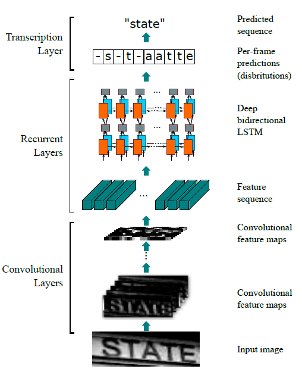
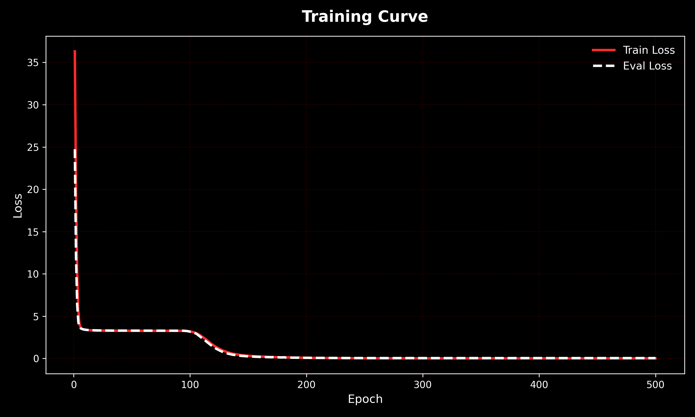

# Applying CRNN to CAPTCHA Recognition
## Introduction
CRNN (Convolutional Recurrent Neural Network) is a deep learning architecture that combines convolutional neural networks (CNN) and recurrent neural networks (RNN) to specifically process data that has spatial structure and sequential characteristics. In computer vision and text recognition tasks, images themselves have spatial features, while text has time series or language sequence properties. Therefore, CRNN provides an end-to-end modeling approach.

Typical application scenarios of CRNN include :
* Scene Text Recognition
* Optical Character Recognition
* Handwritten Character Recognition
* License Plate Recognition

In this project I implemented and demonstrating its application in OCR and CAPTCHA recognition. The entire CRNN architecture and training/testing code framework were built using PyTorch. Using approximately 1000 CAPTCHA images as experimental data, the dataset was split into a 7:3 ratio. A portion of the dataset was used to train a CRNN to minimize the CTC Loss, and the feasibility of this architecture was verified on the other portion of the dataset. Finally, we can see that its model can be trained effectively and significantly.

## Architecture and Technical Details
  

CRNN typically contains three main modules  :
### CNN Feature Extractor
This part typically employs convolutional backbone networks such as LeNet, VGG, or others, with the aim of :

* Extracting high-order semantic features from the input image
* Preserving local spatial information
* Reducing dimensionality and improving feature representation capabilities

### RNN Sequence Modeling
The feature maps generated by the CNN are unfolded into a sequence along the width direction and then input into an RNN (commonly LSTM or GRU).
* Bidirectional LSTM (BiLSTM) is a common choice.
* Capable of capturing contextual information
* Solving the problem that a single window cannot understand the meaning of the entire string.

### Transcription Layer
CRNNs are typically paired with CTC (Connectionist Temporal Classification) as the loss function for :
* No character-level alignment annotation required
* Automatically handles inputs and outputs of different lengths
* Solving time alignment issues

### Research Paper
CRNN (Convolutional Recurrent Neural Network) was originally proposed by Baoguang Shi et al. and published in the paper "An End-to-End Trainable Neural Network for Image-based Sequence Recognition and Its Application to Scene Text Recognition". This research aims to solve the problem of recognizing sequential data in images, especially scene text recognition, and proposes a deep neural network architecture that can be trained end-to-end and does not require segmentation.

Experimental results show that CRNN achieved state-of-the-art performance on multiple public scene text datasets at the time (2015), while also possessing advantages such as relatively simple parameter count, ability to handle variable-length inputs, and generalizability to other image sequence recognition tasks.

## CAPTCHA Dataset for Machine Learning
This dataset contains 1070 images of CAPTCHA, designed to help in training machine learning models for CAPTCHA recognition and solving tasks. CAPTCHA, or "Completely Automated Public Turing test to tell Computers and Humans Apart," is widely used to prevent automated bots from interacting with web services. Recognizing CAPTCHA is a classic machine learning problem that involves image processing, text recognition, and sequence modeling.

https://www.kaggle.com/datasets/mrigaankjaswal/capcha-images-to-training-data

Image Format: PNG
Label Format: Text (corresponding to the CAPTCHA shown in the image)
Average Length of CAPTCHA: Varies (generally 4-6 characters)
CAPTCHA Type: Text-based, containing a mix of alphanumeric characters
Dataset Structure - Each image file is named based on the text it represents (for example, abc123.png for a CAPTCHA showing "abc123")

## Training Method
### Loss Function :  CTC loss
Connectionist Temporal Classification Loss (CTC Loss)
### Optimizer   :   Adam Optimizer
Adam retains Momentume's gradient rate adjust based on the direction of past gradients and Adam's learning rate adjustment based on the squared value of past gradients. In addition, Adam performs parameter "Deviation Correction", ensuring that the learning rate has a defined range for each iteration, resulting in more stable parameter updates.
### Reduce LR On Plateau

## Validation Metrics

### Character Error Rate / Character Accuracy

### OCR Full Accuracy

## Result
### Training Curve

### Demo Test

### Final Accuracy
|Dataset|CTC Loss|Character Error Rate |Character Accuracy|OCR Full Accuracy |
|-|-|-|-|-| 
|Train|0.0031 |0.0000 | 100.00% |100.00%  |
|Test |0.0425 |0.0100 |  99.00% | 95.02%  |

 