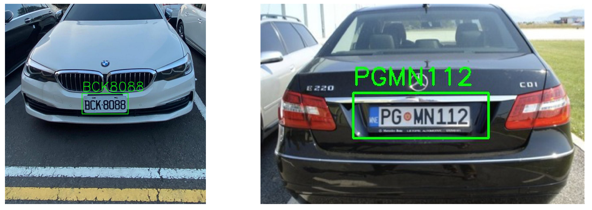

# License-Plate-Recognition

A computer vision project for automatic license plate detection and recognition.  
This project integrates traditional Haar Cascade detection, YOLOv11 object detection, and Tesseract OCR to build an end-to-end license plate recognition pipeline.



## Project Overview

The goal of this project is to detect license plates from vehicle images, crop the license plate region, and recognize the text content automatically.


The project explores two major license plate detection approaches:

- **Haar Cascade Classifier**
- **YOLOv11 Object Detection**

After detecting the license plate region, the cropped image is processed and passed into **Tesseract OCR** for text recognition.

The complete workflow is:

```text
Input Image
→ License Plate Detection
→ Plate ROI Cropping
→ Image Enhancement / Perspective Correction
→ OCR Recognition
→ Final Output
```

## Development Period

**May 10 st ~ May 24 st, 2025**

## Author

**Jiaen Suen**
