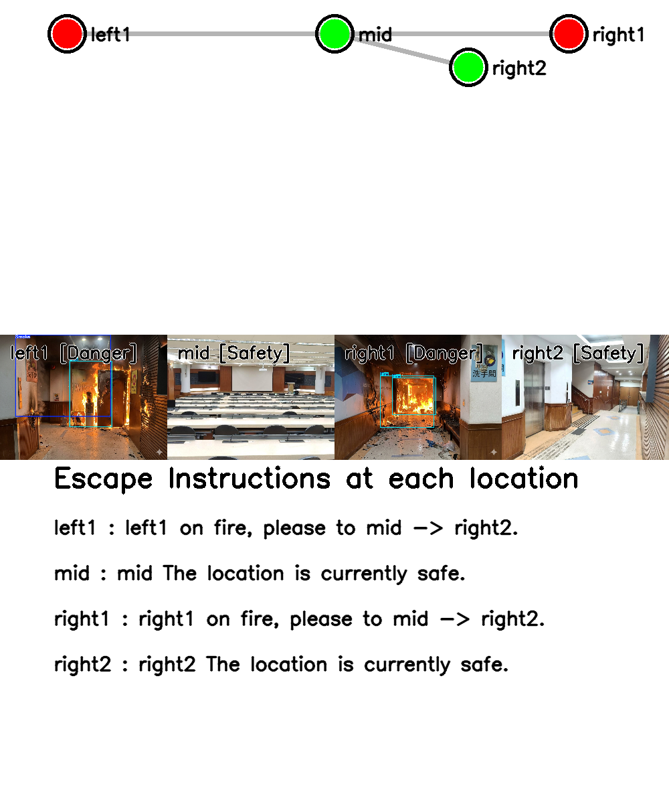
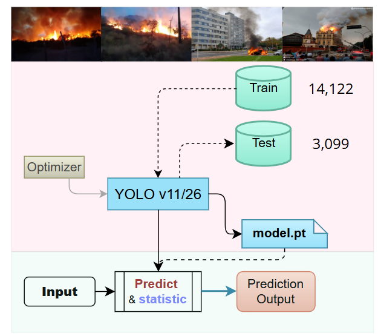
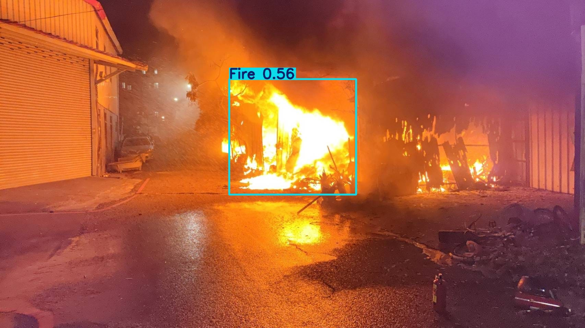
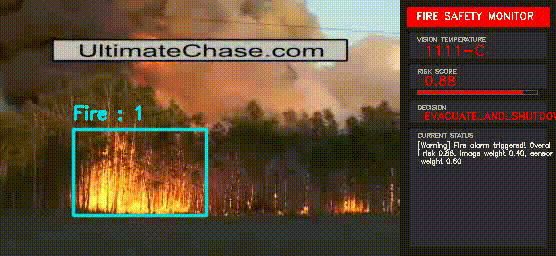

# CS Department Hackathon : Vision Communication Routing based on Sensor Fusion

This project was developed during the CS Department Hackathon hosted by the Student Association at National Kaohsiung University of Science and Technology (NKUST).

## Dataset
Dataset Source : https://www.kaggle.com/datasets/sayedgamal99/smoke-fire-detection-yolo?resource=download

Sample Code : https://github.com/johnmartinsson/fire-event-detection-dataset

test url : http://signal.ee.bilkent.edu.tr/VisiFire/Demo/

## YOLO Model Training

## YOLOv11- PyroDetector

